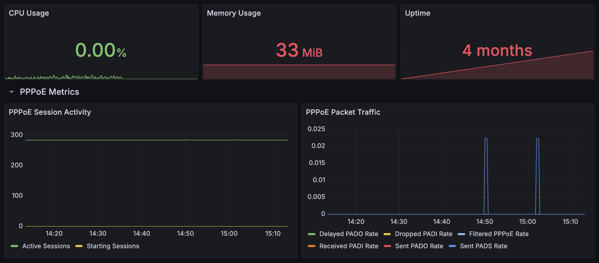

# Accel-PPP Prometheus Exporter

[](https://github.com/taihen/accel-exporter/actions/workflows/test.yml)
[](https://github.com/taihen/accel-exporter/actions/workflows/release.yml)
[](https://goreportcard.com/report/github.com/taihen/accel-exporter)

A Prometheus exporter for [Accel-PPP](https://github.com/accel-ppp/accel-ppp) that exposes metrics from the `accel-cmd show stat` command.

Some small story behind this exporter on my [blog](https://taihen.org/posts/accel-exporter/).

## Minimum Requirements

- Go 1.24 or higher (that what I'm using, most likely is compatible down to Go 1.20)
- Accel-PPP 1.12 or compatible version
- Permission to execute `accel-cmd show stat` command

>[!NOTE]
> This exporter has been tested with `accel-ppp`:
> - 1.12

## Features

- Exposes all metrics from `accel-cmd show stat` as Prometheus metrics (have to have access rights to issue command)
- Configurable listen address (default: :9101)
- Configurable metrics path (default: /metrics)
- Configurable path to `accel-cmd` binary
- Ready-to-use Grafana dashboard

## Installation

### Prebuilt Binaries

Download the latest release from the [Releases page](https://github.com/taihen/accel-exporter/releases).

### Debian/Ubuntu Package

For Debian 11 (Bullseye) and Debian 12 (Bookworm), download the appropriate `.deb` package from the [Releases page](https://github.com/taihen/accel-exporter/releases):

```bash
# Download the package (replace VERSION and DEBIAN_VERSION accordingly)
wget https://github.com/taihen/accel-exporter/releases/download/v1.0.0/accel-exporter_1.0.0-1_amd64.deb

# Install the package
sudo dpkg -i accel-exporter_1.0.0-1_amd64.deb

# Start and enable the service
sudo systemctl start accel-exporter
sudo systemctl enable accel-exporter

# Check service status
sudo systemctl status accel-exporter
```

The Debian package includes:
- Systemd service with security hardening
- Dedicated `accel-exporter` user account
- Automatic service management
- Configuration in `/etc/default/accel-exporter` (if needed)

### Docker

```bash
docker run -d --name accel-exporter -p 9101:9101 taihen/accel-exporter:latest
```

### From Source

```bash
go install github.com/taihen/accel-exporter/cmd/accel-exporter@latest
```

## Usage

```bash
Usage of accel-exporter:
  -accel-cmd.path string
        Path to accel-cmd binary (default "accel-cmd")
  -log.level string
        Log level (debug, info, warn, error) (default "info")
  -web.listen-address string
        Address to listen on (default ":9101")
  -web.metrics-path string
        Path to expose metrics (default "/metrics")
```

You can also configure the exporter using environment variables:

- `ACCEL_EXPORTER_PORT`: The port to listen on (overrides `-web.listen-address`)

## Prometheus Configuration

Add a scrape configuration to your `prometheus.yml`:

```yaml
scrape_configs:
  - job_name: 'accel-ppp'
    static_configs:
      - targets: ['localhost:9101']
```

## Grafana Dashboard

A Grafana dashboard is included in the `dashboards` directory. You can import it into your Grafana instance.



## Building from Source

```bash
# Clone the repository
git clone https://github.com/taihen/accel-exporter.git
cd accel-exporter

# Build
go build -o accel-exporter ./cmd/accel-exporter

# Run
./accel-exporter
```

## Docker Build

```bash
docker build -t accel-exporter .
docker run -p 9101:9101 accel-exporter
```

## Metrics

The exporter exposes the following metrics:

**General:**

- `accel_exporter_build_info{version, commit, date}`: Metric with constant '1' value  
  labeled with version, commit, and build date
- `accel_up`: Was the last accel-cmd scrape successful (1 = yes, 0 = no).
- `accel_scrape_failures_total`: Number of errors while scraping accel-cmd.
- `accel_uptime_seconds`: Uptime of accel-ppp in seconds.
- `accel_cpu_usage_percent`: CPU usage percentage.
- `accel_memory_rss_bytes`: RSS memory usage in bytes.
- `accel_memory_virtual_bytes`: Virtual memory usage in bytes.

**Core:**

- `accel_core_mempool_allocated_bytes`: Allocated memory pool size
- `accel_core_mempool_available_bytes`: Available memory pool size
- `accel_core_thread_count`: Number of core threads
- `accel_core_thread_active`: Number of active core threads
- `accel_core_context_count`: Number of core contexts
- `accel_core_context_sleeping`: Number of sleeping core contexts
- `accel_core_context_pending`: Number of pending core contexts
- `accel_core_md_handler_count`: Number of MD handlers
- `accel_core_md_handler_pending`: Pending MD handlers count
- `accel_core_timer_count`: Number of core timers
- `accel_core_timer_pending`: Number of pending core timers

**Sessions:**

- `accel_sessions_starting`: Number of sessions starting
- `accel_sessions_active`: Number of active sessions
- `accel_sessions_finishing`: Number of sessions finishing

**PPPoE:**

- `accel_pppoe_starting`: Number of PPPoE sessions starting
- `accel_pppoe_active`: Number of active PPPoE sessions
- `accel_pppoe_delayed_pado`: Number of delayed PADO packets
- `accel_pppoe_recv_padi_total`: Total received PADI packets
- `accel_pppoe_drop_padi_total`: Total dropped PADI packets
- `accel_pppoe_sent_pado_total`: Total sent PADO packets
- `accel_pppoe_recv_padr_total`: Total received PADR packets
- `accel_pppoe_recv_padr_dup_total`: Total received duplicate PADR packets
- `accel_pppoe_sent_pads_total`: Total sent PADS packets
- `accel_pppoe_filtered_total`: Total filtered PPPoE packets

**RADIUS (Labels: `server_id`, `server_ip`):**

- `accel_radius_state`: State of RADIUS server (1 = active, 0 = inactive)
- `accel_radius_fail_count_total`: Total RADIUS server fail count
- `accel_radius_request_count`: Current RADIUS server request count
- `accel_radius_queue_length`: Current RADIUS server queue length
- `accel_radius_auth_sent_total`: Total RADIUS auth packets sent
- `accel_radius_auth_lost_total`: Total RADIUS auth packets lost
- `accel_radius_auth_lost_5m`: RADIUS auth packets lost (5m window)
- `accel_radius_auth_lost_1m`: RADIUS auth packets lost (1m window)
- `accel_radius_auth_avg_time_5m_seconds`: Average auth response time (5m)
- `accel_radius_auth_avg_time_1m_seconds`: Average auth response time (1m)
- `accel_radius_acct_sent_total`: Total accounting packets sent
- `accel_radius_acct_lost_total`: Total accounting packets lost
- `accel_radius_acct_lost_5m`: Accounting packets lost (5m window)
- `accel_radius_acct_lost_1m`: Accounting packets lost (1m window)
- `accel_radius_acct_avg_time_5m_seconds`: Average accounting response (5m)
- `accel_radius_acct_avg_time_1m_seconds`: Average accounting response (1m)
- `accel_radius_interim_sent_total`: Total interim accounting packets sent
- `accel_radius_interim_lost_total`: Total interim accounting packets lost
- `accel_radius_interim_lost_5m`: Interim packets lost (5m window)
- `accel_radius_interim_lost_1m`: Interim packets lost (1m window)
- `accel_radius_interim_avg_time_5m_seconds`: Avg interim response (5m)
- `accel_radius_interim_avg_time_1m_seconds`: Avg interim response (1m)

## License

MIT
